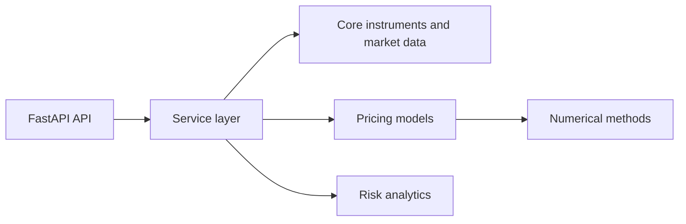

# DeltaCore

[](https://github.com/HtFilia/DeltaCore/actions/workflows/ci.yml)


Production-minded Python backend for derivatives pricing, Greeks, volatility
calibration, and market-risk analytics.

DeltaCore is built as a focused quantitative engineering portfolio project: pure
pricing kernels, typed API boundaries, explicit numerical assumptions, and tests
that validate model behavior against known references and invariants.

## At A Glance

| Area | Current status |
| --- | --- |
| Pricing | European call/put options under Black-Scholes and Bachelier |
| API | FastAPI endpoints for `/health` and `/price/european` |
| Greeks | Analytic Black-Scholes delta, gamma, vega, theta, rho |
| Calibration | Black-Scholes implied volatility with convergence diagnostics |
| Monte Carlo | Black-Scholes European pricing with standard error and confidence interval |
| Risk | Deterministic Black-Scholes scenario PnL and stress repricing |
| Validation | Closed-form fixtures, put-call parity, finite-difference Greeks |
| Quality | Ruff formatting/linting, strict mypy, pytest |
| Roadmap | VaR/ES |

The distribution name is `deltacore`; the Python import namespace remains
`derivatives_risk_engine` to keep the domain model explicit.

## Why It Exists

Many quant projects start as notebooks and never develop production-grade
boundaries. DeltaCore is designed the other way around: small, validated pricing
and risk components first, then API orchestration around them.

The goal is to make numerical finance work inspectable by a reviewer:

- formulas and conventions are documented in code and tests;
- pricing functions are deterministic and side-effect free;
- API contracts are typed with Pydantic;
- tests favor references and invariants over visual demos.

## Model Conventions

- Black-Scholes uses lognormal spot dynamics, continuous risk-free and dividend
  rates, annualized volatility, and year-fraction time to expiry.
- Bachelier uses a forward normal convention with
  `F = S exp((r - q)T)`, risk-free discounting, and annualized normal volatility
  in price units.
- Black-Scholes Greeks are analytic. Delta and gamma are spot-unit sensitivities,
  vega and rho use absolute volatility/rate bumps, and theta is calendar-time
  decay per year, equivalent to `-dV/dT`.
- Black-Scholes implied volatility uses bounded one-dimensional root finding.
  Results report convergence, objective residual, iteration count, volatility
  bounds, and a structured failure reason when calibration is not possible.
- Monte Carlo pricing uses the risk-neutral Black-Scholes terminal distribution,
  explicit random seeds, discounted payoff means, standard error, and a
  normal-approximation confidence interval.
- Scenario PnL applies absolute shifts to spot, volatility, continuous rates,
  dividend yield, and time to expiry, then reprices under Black-Scholes. PnL is
  `shocked_price - base_price`.

## Quickstart

```bash
uv sync --extra dev
uv run pytest
```

Run the full local quality gate:

```bash
uv run ruff format --check .
uv run ruff check .
uv run mypy src tests
uv run pytest
```

## Use The Pricing Kernel

The Black-Scholes implementation assumes lognormal spot dynamics, continuous
risk-free and dividend rates, annualized volatility, and time to expiry expressed
as a year fraction. Inputs are deterministic and use no live market data.

```python
from derivatives_risk_engine.core.instruments import EuropeanOption
from derivatives_risk_engine.core.market import BlackScholesMarket
from derivatives_risk_engine.models.black_scholes import black_scholes_price

option = EuropeanOption(option_type="call", strike=100.0, time_to_expiry=1.0)
market = BlackScholesMarket(
    spot=100.0,
    risk_free_rate=0.05,
    dividend_yield=0.0,
    volatility=0.20,
)

price = black_scholes_price(option, market)
print(price)  # 10.450583572185565
```

Use the Bachelier normal model:

```python
from derivatives_risk_engine.core.instruments import EuropeanOption
from derivatives_risk_engine.core.market import BachelierMarket
from derivatives_risk_engine.models.bachelier import bachelier_price

option = EuropeanOption(option_type="call", strike=100.0, time_to_expiry=1.0)
market = BachelierMarket(
    spot=100.0,
    risk_free_rate=0.05,
    dividend_yield=0.0,
    normal_volatility=15.0,
)

price = bachelier_price(option, market)
print(price)  # 8.460134478825838
```

Compute Black-Scholes Greeks:

```python
from derivatives_risk_engine.core.instruments import EuropeanOption
from derivatives_risk_engine.core.market import BlackScholesMarket
from derivatives_risk_engine.risk.greeks import black_scholes_greeks

option = EuropeanOption(option_type="call", strike=100.0, time_to_expiry=1.0)
market = BlackScholesMarket(
    spot=100.0,
    risk_free_rate=0.05,
    dividend_yield=0.0,
    volatility=0.20,
)

greeks = black_scholes_greeks(option, market)
print(greeks.delta, greeks.vega)
```

Solve Black-Scholes implied volatility:

```python
from derivatives_risk_engine.calibration.implied_vol import (
    solve_black_scholes_implied_volatility,
)
from derivatives_risk_engine.core.instruments import EuropeanOption

option = EuropeanOption(option_type="call", strike=100.0, time_to_expiry=1.0)

result = solve_black_scholes_implied_volatility(
    option=option,
    spot=100.0,
    risk_free_rate=0.05,
    dividend_yield=0.0,
    target_price=10.450583572185565,
)

print(result.implied_volatility)  # 0.20
print(result.diagnostics.converged)
```

Run deterministic Monte Carlo pricing:

```python
from derivatives_risk_engine.core.instruments import EuropeanOption
from derivatives_risk_engine.core.market import BlackScholesMarket
from derivatives_risk_engine.numerics.monte_carlo import monte_carlo_black_scholes_price

option = EuropeanOption(option_type="call", strike=100.0, time_to_expiry=1.0)
market = BlackScholesMarket(
    spot=100.0,
    risk_free_rate=0.05,
    dividend_yield=0.0,
    volatility=0.20,
)

result = monte_carlo_black_scholes_price(
    option=option,
    market=market,
    num_paths=50_000,
    seed=7,
)

print(result.price, result.standard_error)
print(result.confidence_interval_low, result.confidence_interval_high)
```

Run deterministic stress scenarios:

```python
from derivatives_risk_engine.core.instruments import EuropeanOption
from derivatives_risk_engine.core.market import BlackScholesMarket
from derivatives_risk_engine.risk.scenario import (
    MarketShock,
    run_black_scholes_scenarios,
)

option = EuropeanOption(option_type="call", strike=100.0, time_to_expiry=1.0)
market = BlackScholesMarket(
    spot=100.0,
    risk_free_rate=0.05,
    dividend_yield=0.0,
    volatility=0.20,
)

results = run_black_scholes_scenarios(
    option,
    market,
    (
        MarketShock(name="spot_down_5", spot_shift=-5.0),
        MarketShock(name="vol_up_5_points", volatility_shift=0.05),
    ),
)

for result in results:
    print(result.scenario_name, result.pnl)
```

## Try The API

Run the service:

```bash
uv run uvicorn derivatives_risk_engine.api.main:app --reload
```

<details>
<summary>POST /price/european</summary>

```bash
curl -X POST http://127.0.0.1:8000/price/european \
  -H 'content-type: application/json' \
  -d '{
    "option_type": "call",
    "spot": 100.0,
    "strike": 100.0,
    "time_to_expiry": 1.0,
    "risk_free_rate": 0.05,
    "dividend_yield": 0.0,
    "volatility": 0.20
  }'
```

```json
{
  "model": "black_scholes",
  "option_type": "call",
  "price": 10.450583572185565,
  "convention": "continuous_rates_annualized_volatility"
}
```

</details>

## Architecture



Dependency direction is intentionally simple:

```text
api -> services -> core/models/numerics/risk
```

Domain code does not depend on FastAPI. Pricing kernels stay pure and
deterministic so they can be tested independently from transport concerns.

## Numerical Validation

| Check | What it protects |
| --- | --- |
| Closed-form call fixture | Black-Scholes call value under continuous rates |
| Closed-form put fixture | Put sign convention and discounting |
| Bachelier fixtures | Normal-model prices under forward-discounted convention |
| Put-call parity with dividends | Internal consistency across calls and puts in both models |
| Analytic Greeks vs finite difference | Delta, gamma, vega, theta, and rho conventions |
| Implied volatility inversion | Recovers known vol and reports impossible prices |
| Monte Carlo confidence interval | Fixed-seed simulation contains closed-form price |
| Scenario PnL repricing | Shocked price equals direct Black-Scholes repricing |
| Expiry intrinsic value | Correct zero-time limiting behavior |
| API integration smoke test | Request/response contract and service wiring |

Current local result:

```text
36 passed
```

## Roadmap

- [x] Bootstrap Python package, test layout, linting, typing, and FastAPI app.
- [x] Implement Black-Scholes European call/put pricing.
- [x] Validate with closed-form fixtures and put-call parity.
- [x] Add Bachelier pricing for normal-volatility workflows.
- [x] Add analytic and finite-difference Greeks.
- [x] Add implied-volatility solving with convergence diagnostics.
- [x] Add Monte Carlo pricing with confidence intervals.
- [x] Add scenario PnL and deterministic stress tests.
- [ ] Add VaR and Expected Shortfall.

## Project Boundaries

DeltaCore is not a live trading system and does not ingest market data. The
current implementation is a validated backend slice for vanilla European option
pricing, Black-Scholes Greeks, Black-Scholes implied-volatility inversion, and
Monte Carlo pricing with confidence intervals, plus deterministic scenario PnL.
Exotic products, calibration surfaces, VaR/ES, and broader market-risk workflows
are planned milestones and will be documented with explicit assumptions as they
are implemented.
